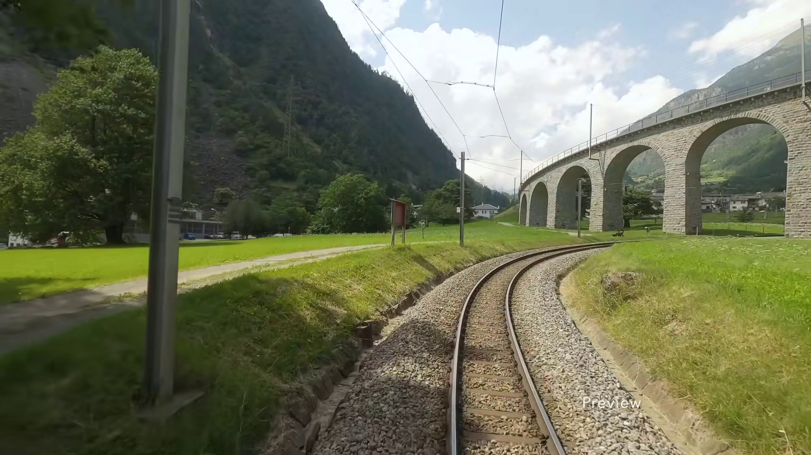
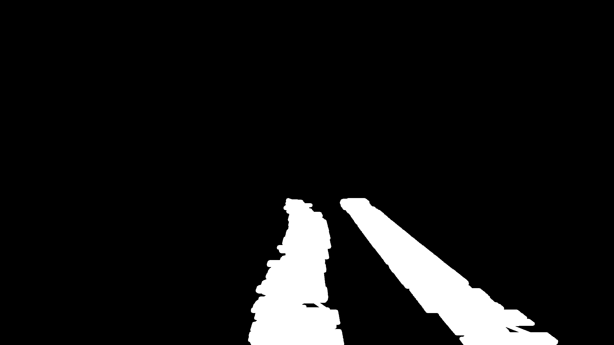
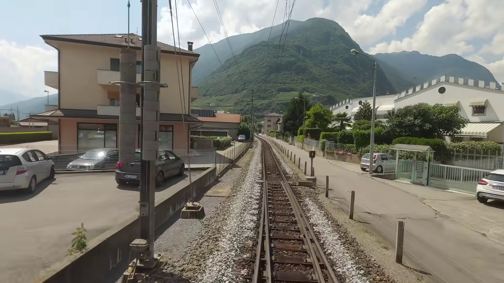
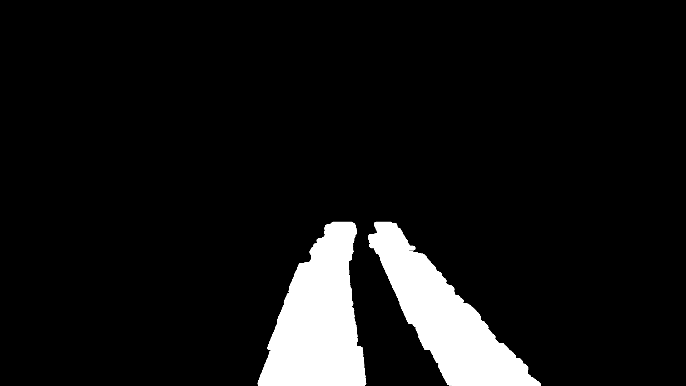
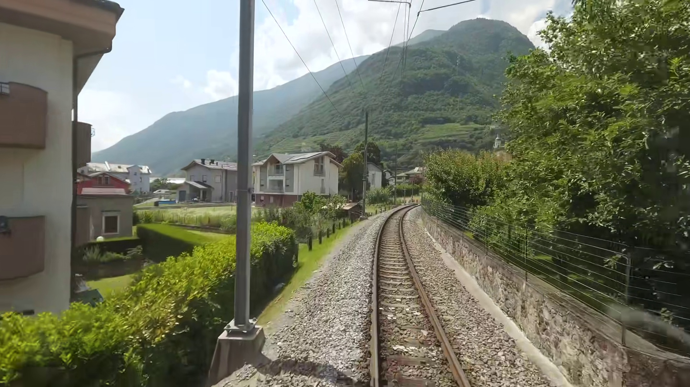

# Ahmet Çimen 07/21/2026 Çalışma Notları

## Özet
Bugün normalde, segmentasyon modeli tarafından üretilen tren rayı maskelerine **skeletonization** işlemi uygulayarak rayların merkez çizgisini çıkarmam, ardından bu çizgiyi matematiksel bir eğriye dönüştürerek eğrinin kareler arasındaki kararlılığını artırmak amacıyla **Kalman Filter** ve **Optical Flow** gibi yöntemleri uygulamam bekleniyordu.

Ancak bu aşamaya geçebilmek için öncelikle videolardan güvenilir tren rayı maskeleri elde etmem gerekiyor. Bunun için önce kullanılacak segmentasyon modelinin belirlenmesi, ardından modelin etiketli veri gerektirip gerektirmediğinin değerlendirilmesi gerekiyor. Etiketli veri gerektiren modeller için ise elimizde bulunan video kayıtlarından uygun bir eğitim veri seti oluşturulması gerekiyor.

Etiketlenecek görselleri elde etmek için video şeklinde verilen veriden **OpenCV** kullanarak belirli aralıklarda kareler kaydedip deneme olarak 200 kareden oluşan etiketsiz bir veri seti oluşturdum. Oluşturulan veri setinde tren rayı görüntüsü içermeyen (örneğin videonun giriş kısmındaki harita görüntüleri) veya video üzerine eklenmiş yazıların rayların üzerine geldiği kareleri, gerçek dışı senaryolar oluşturduğu için veri setinden çıkardım.

| Ham Kamera Görseli (`image`) | Siyah-Beyaz Segmentasyon Maskesi (`label`) |
| :---: | :---: |
|  |  |
|  |  |
|  |  |

Otomatik etiketleme; Bird's Eye View (BEV) transform, Canny Edge Detection ve Sliding Window gibi klasik bilgisayar görüşü teknikleri ile gerçekleştirilmiş, ancak karmaşık sahnelerde etiketli verileri hazırlamada **yetersiz kalmıştır**.

Bu kapsamda, elimizde bulunan etiketsiz video verisini nasıl etiketleyebileceğime yönelik yöntemleri araştırdım. İncelediğim yaklaşımlar genel olarak **manuel etiketleme** ve **otomatik etiketleme** olmak üzere iki gruba ayrılmaktadır.

**Manuel etiketleme** için öne çıkan araçlar:
- CVAT
- Roboflow
- Label Studio

Bu araçlar, görüntüler üzerinde doğrudan piksel seviyesinde segmentasyon maskeleri oluşturmaya olanak sağlamaktadır.

Manuel etiketleme yöntemlerinde en büyük dezavantaj, özellikle tren rayı gibi uzun ve sürekli yapıya sahip nesnelerde her görüntünün insan tarafından tek tek işaretlenmesinin zaman alıcı olmasıdır. Ancak bu yöntemin avantajı, modelin öğrenmesi gereken nesnenin sınırlarının ve istenilen etiket formatının daha kontrollü şekilde oluşturulabilmesidir.

**Otomatik etiketleme** tarafında ise aşağıdaki yöntemleri inceledim:

- **Segment Anything Model (SAM/SAM2):** Kullanıcı girdileri (nokta, kutu vb.) yardımıyla nesne maskesi oluşturabilen segmentasyon modelleridir. Ancak kullanıcıdan nokta veya bounding box gibi ek bir giriş beklediği için tamamen otomatik bir etiketleme yöntemi olarak değerlendirilemez.

- **Roboflow Auto Labeling (SAM3 tabanlı):** Prompt kullanılarak görüntülerin otomatik şekilde etiketlenmesini sağlamaktadır. Ancak mevcut kullanım senaryosunda batch işlemleri için uygun değildir. Tüm görüntülerin tek tek sisteme verilmesi ve etiketlenmesi gerektiği için büyük veri setlerinde zaman açısından yeterli olmayabilir.

- **Grounding DINO + SAM:** Grounding DINO tarafından üretilen nesne sınırlayıcı kutularının (bounding box) SAM'e giriş olarak verilmesiyle, ilgili nesnenin piksel seviyesinde segmentasyon maskesinin otomatik olarak elde edilmesi amaçlanmaktadır. Ancak bu yöntemde iki farklı modelin birlikte doğru çalışması gerekmektedir. Grounding DINO verilen prompt içerisindeki nesneyi tespit edemeyebilir veya nesnenin tamamı yerine yalnızca bir kısmını bounding box içerisine alabilir. Benzer şekilde SAM modeli de verilen bounding box içerisindeki ray hattını istenilen doğrulukta segmentleyemeyebilir.

Alternatif olarak, mevcut bir segmentasyon modelinin küçük bir veri seti ile önceden eğitilmesi ve ardından oluşturulan model kullanılarak veri setinin geri kalan kısmının otomatik olarak etiketlenmesi yöntemi de değerlendirilebilir. Örneğin **YOLOv8 veya YOLOv11 segmentation** modelleri küçük miktarda etiketli veri ile fine-tune edilerek, kalan görüntüler için otomatik annotation amacıyla kullanılabilir.

Bu yöntemlerin yanı sıra otomatik etiketleme sürecindeki zorlukları ve tren rayı tespiti için uygunluğunu araştırdım. İncelediğim kaynaklarda, otomatik annotation yöntemlerinin her nesne tipi için aynı başarıyı göstermediği belirtilmektedir.

Özellikle tren rayları gibi uzun, ince ve görüntü içerisinde sürekli devam eden yapılar klasik nesne tespit veya genel segmentasyon modelleri için zorlayıcı olmaktadır. Segment Anything tabanlı otomatik segmentasyon yöntemleri birçok nesne için başarılı sonuçlar verebilse de tren raylarını tek bir bütün nesne olarak algılamakta zorlanabilmektedir. Bunun sonucunda anlamlı maske veya poligon çıktıları elde edilemeyebilir. Benzer şekilde, nesne tespit tabanlı yöntemler de daha önce bu tür özel nesneler üzerinde eğitilmedikleri durumda ray hattı veya makas bölgelerini doğru şekilde tespit edemeyebilir.

İncelediğim kaynaklarda manuel ve otomatik annotation süreçleri ile ilgili aşağıdaki sonuçlara ulaşılmıştır:

**Manuel Annotation:**

Tren rayı etiketleme işlemlerinde klasik poligon tabanlı yöntemler yerine, rayların belirli noktalar üzerinden işaretlenip aralarının matematiksel eğriler ile tamamlandığı yöntemlerin daha verimli olduğu belirtilmektedir. Örneğin Labels4Rails isimli araçta kullanılan **Catmull–Rom spline** yaklaşımı sayesinde, klasik poligonlara göre daha az sayıda nokta kullanılarak ray eğriliği modellenebilmekte ve etiketleme süresi azaltılmaktadır. Ancak yine de rayların hangi hatta ait olduğunun kullanıcı tarafından belirlenmesi gerekmektedir.

**Otomatik Annotation:**

Otomatik annotation yöntemleri manuel işlemleri azaltarak veri oluşturma sürecini hızlandırmayı amaçlasa da tren rayı gibi özel yapılar için bazı sınırlamalara sahiptir. Örneğin CVAT içerisinde kullanılan Segment Anything tabanlı otomatik segmentasyon yöntemi, rayları tek bir nesne olarak algılayamadığı için anlamlı maske veya poligon üretmekte başarısız olabilmektedir. Buna karşın ray üzerinde veya yakınında bulunan tren gibi daha belirgin nesnelerde daha başarılı sonuçlar verebilmektedir.

Benzer şekilde YOLO tabanlı otomatik nesne tespit yöntemleri de daha önce bu tür nesneler ile eğitilmediği durumda tren rayı makasları veya özel ray geometrilerini algılamakta zorlanabilmektedir.

Bu araştırmalar sonucunda, tren rayı segmentasyonu için tamamen otomatik annotation yöntemlerinin mevcut haliyle yeterli doğruluğu sağlamayabileceği, ancak manuel etiketleme ile otomatik yöntemlerin birlikte kullanıldığı hibrit yaklaşımların daha uygulanabilir olduğu değerlendirilmiştir. Ayrıca, açık kaynaklı paylaşılan veri setlerinin kullanımı da değerlendirilebilir.

Kaynak:
Labels4Rails: A Railway Image Annotation Tool and Associated Reference Dataset
https://www.mdpi.com/2306-5729/10/12/210