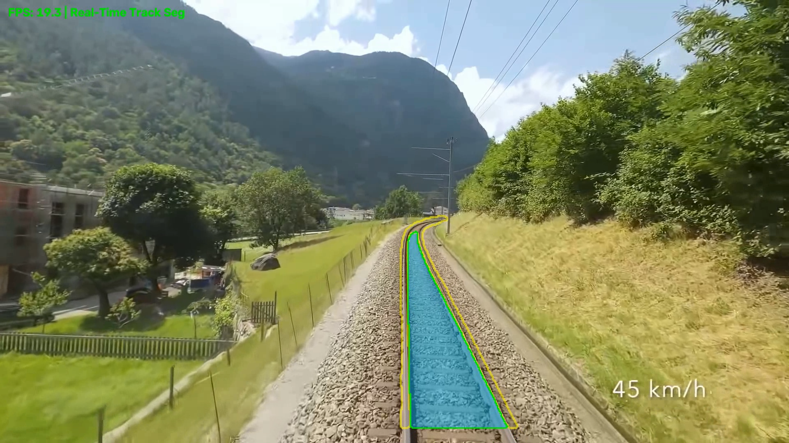
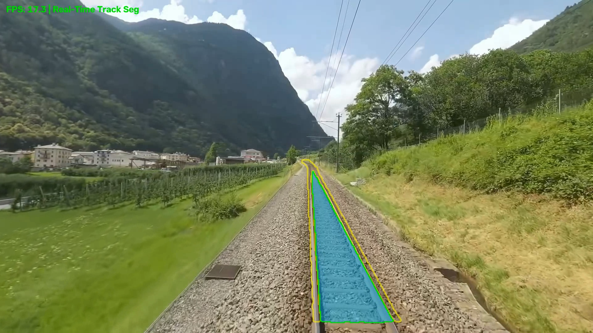
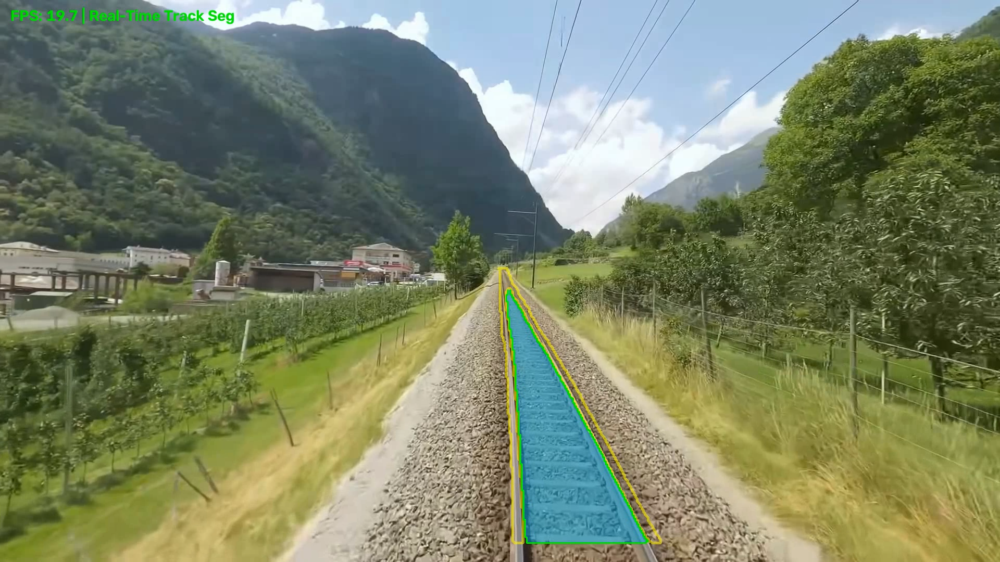
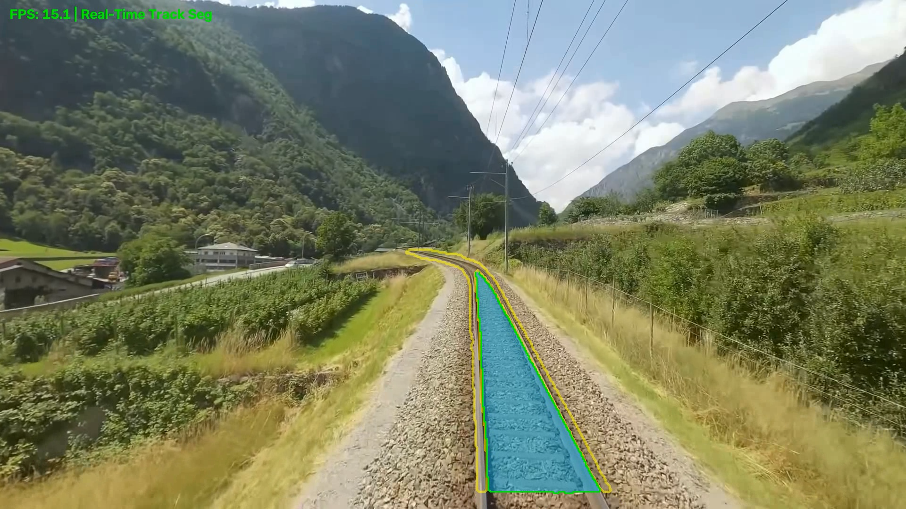

# Ahmet Çimen 07/22/2026 Çalışma Notları

Bu proje, **RailSem19** açık kaynak veri seti kullanılarak geliştirilen YOLOv8-seg tabanlı demiryolu hattı (`rail-track`) ve metal ray çizgilerinin (`rail-line`) segmentasyonu, dikey kesit nokta çıkarımı ve sinyal işleme yöntemleri ile iyileştirilmesini içermektedir.

---

## 1. Veri Seti Seçimi ve Hazırlığı

Sıfırdan bir derin öğrenme modeli için piksel düzeyinde veri seti etiketlemek oldukça zorlu ve zaman alıcı bir süreçtir. Bu nedenle çalışmamızda uluslararası literatürde demiryolu sahnelerini anlama alanında standart kabul edilen **RailSem19** (*AIT Austrian Institute of Technology GmbH - Oliver Zendel et al.*) açık kaynak veri seti kullanılmıştır.

- **Veri Seti Yapısı:** RailSem19 içerisinde tabela, binalar, arazi, nesneler gibi çok sayıda detaylı sınıf etiketlemesi yer almaktadır.
- **Sınıf İndirgeme:** Proje amacımız doğrultusunda sadece işimize yarayan **2 ana sınıf** filtrelenerek kullanılmıştır:
  1. `rail-track` (Trenin üzerinde hareket edeceği sürüş yolu alanı)
  2. `rail-line` (Fiziksel sol ve sağ metal ray hatları)
- **Prototip Veri Miktarı:** Prototip geliştirme ve hızlı doğrulama amacıyla veri setindeki 8,500 görselin **%35'lik kısmı (2,975 adet 1080p yüksek çözünürlüklü görsel)** eğitime alınmıştır.

---

## 2. Model Eğitimi ve İlk Çıktıların Analizi

- **Model Mimarisi:** `YOLOv8 Segmentation (YOLOv8s-seg)` mimarisi **NVIDIA GeForce RTX 3050 GPU** üzerinde 25 epoch boyunca eğitilmiştir.
- **İlk Çıktı Problemleri:** Eğitilen modelin ham (raw) çıkarım sonuçları incelendiğinde;
  - Ray hattının dışına taşan düzensiz yeşil/turkuaz alanlar,
  - Traversler ve ışık kırılmaları nedeniyle parçalanmış maske lekeleri,
  - Tespit edilen ray hatlarında ani titremeler, pürüzler ve parazit yamulmalar
  gibi istenmeyen durumlar gözlemlenmiştir.

---

## 3. Nokta Çıkarımı ve Yumuşatma Yöntemleri

Ham maskelerdeki düzensizlikleri gidermek amacıyla maskedeki sol ve sağ sınır hatları dikey kesitler üzerinden ayrıştırılarak koordinat noktaları dizisi `(x_left, y)` ve `(x_right, y)` haline getirilmiştir.

### 3.1. Deneme 1: Polynomial Curve Fitting (Başarısız)

Noktalar üzerinde ilk olarak **Polinom Eğri Uydurma (Polynomial Curve Fitting)** yöntemi uygulanmıştır.

- **Sonuç:** Polinom formülleri beklenilen esnekliği gösterememiştir. Yüksek eğimli keskin virajlarda, kavisli dönemeçlerde ve S-şeklindeki yollarda katı polinom dereceleri yetersiz kalmış ve çizgilerin rayın dışına sapmasına neden olmuştur.

### 3.2. Deneme 2: Tek Boyutta Konvolüsyon Penceresi (Moving Window Smoothing)

Polinomun başarısızlığı üzerine Sinyal İşleme (Digital Signal Processing - DSP) tekniklerinden **Tek Boyutta Konvolüsyon Penceresi (Moving Window Smoothing)** kullanılmıştır.

- **Mantık:** Konvolüsyon penceresi bir X koordinatına bakarken, kendisinden önceki 7 noktanın ağırlıklı ortalamasını alarak X noktasının konumunu pürüzsüz biçimde yeniden hesaplar.
- **Kazanım:** Ray üzerindeki ani titremeler, gürültüler ve sıçramalar virajların doğal kıvrımı bozulmadan başarıyla bastırılmıştır.

---

## 4. Bottom-Up Yaklaşımı ve Görsel Kalite

- **Bottom-Up Yaklaşımı:** Tüm dikey kesit alma ve nokta hesaplama süreci **Bottom-Up (Aşağıdan Yukarıya)** mantığıyla yürütülmüştür. Tren kamerasında en net ve hatasız tespitler kameraya en yakın (alt) bölgede gerçekleşmektedir. Aşağıdan yukarıya doğru ilerlenerek bir önceki çizginin ortalaması, bir sonraki oluşacak çizginin konumunun hesaplanmasında kılavuzluk etmiştir.
- **Anti-Aliased Çizim (`cv2.LINE_AA`):** Çizgilerin ekrandaki görsel kalitesini artırmak ve pikselleşmeyi/basamaklanmayı önlemek için OpenCV'deki **Anti-Aliasing (`cv2.LINE_AA`)** algoritmasıyla çizim yapılmıştır.

---

## 5. Örnek Video Çıkarım Sonuçları

Aşağıdaki ekran görüntüleri, eğitilen modelin bir örnek video üzerinde denendiği ve model çıkarımlarının gösterildiği birkaç kareyi temsil etmektedir:

| Kare 1 | Kare 2 |
| :---: | :---: |
|  |  |

| Kare 3 | Kare 4 |
| :---: | :---: |
|  |  |

---

## 6. Hedefler

Şu anki prototip çıktılarında halen bazı karelerde ufak parazitler, eksik veya fazla tespitler yer alabilmektedir.

Önümüzdeki günlerde daha yüksek başarıma sahip bir ürün çıkarmak için aşağıdaki opsiyonlar ele alınacaktır:

1. **Model Alternatifleri:** YOLOv8-Seg yerine alternatif segmentasyon mimarilerinin (SegFormer, YOLOv11 vb.) test edilmesi.
2. **Tam Veri Seti Eğitimi:** Veri setinin %35'i yerine **tamamının (%100 - 8,500 görsel)** eğitime dahil edilmesi.
3. **Gelişmiş Post-Processing:** Zaman serisi filtreleme (Kalman Filter) ve Optik Akış (Optical Flow) yöntemleri ile kareler arası takibin güçlendirilmesi.
