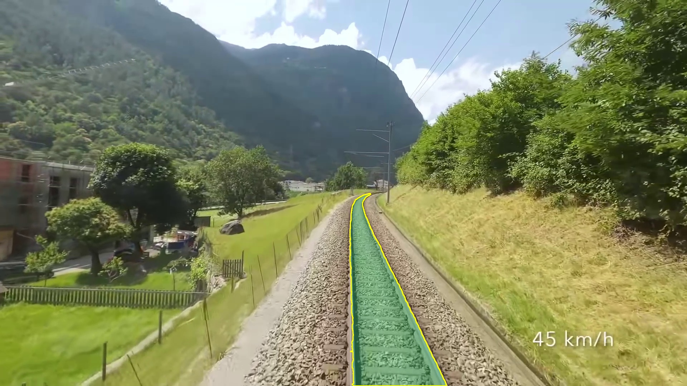
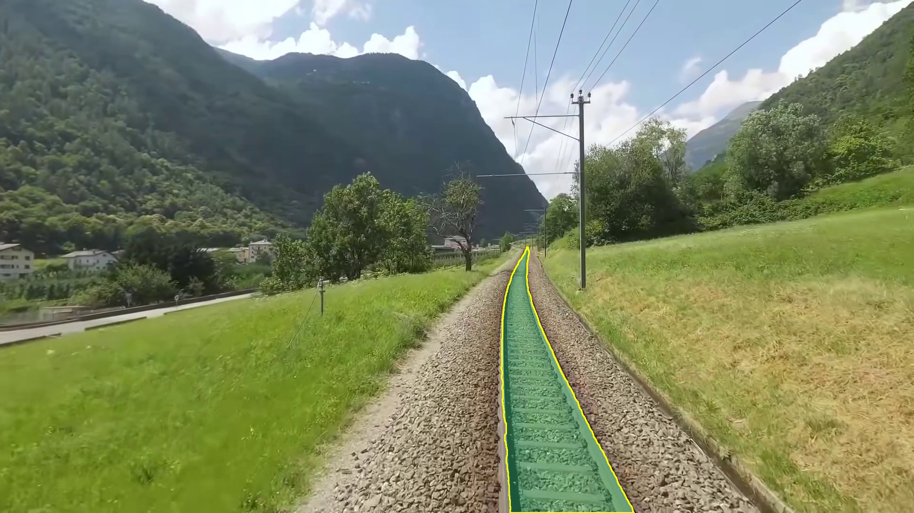
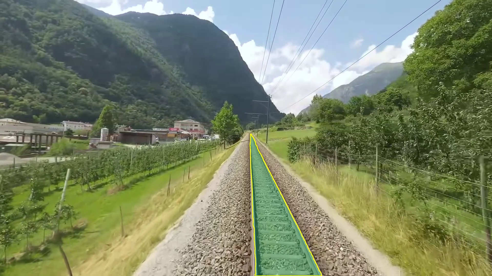

# Ahmet Çimen 07/23/2026 Çalışma Notları 

## 1. Veri Seti ve Sınıf Yapısı

Bugün, bir önceki günde kullanmaya başladığım **RailSem19** veri seti üzerinde derin öğrenme tabanlı **ray koridoru (track) segmentasyonu** çalışmalarına devam ettim. RailSem19 veri seti içerisinde toplam 19 farklı semantik sınıf bulunmaktadır; ancak proje amacımız doğrultusunda yalnızca ray koridorunu temsil eden **`rail-track` (ID: 12)** sınıfı filtrelenerek binary segmentasyon maskelerine dönüştürüldü.

- **Veri Seti Bölme:** Toplam ~8,500 görüntünün **%70'i eğitim**, **%15'i doğrulama** ve **%15'i test** olarak ayrıldı.
- **Maske Formatı:** Binary (0 = arka plan, 1 = ray koridoru), uint8 PNG formatında üretildi.
- **Giriş Çözünürlüğü:** Tüm görüntüler eğitim öncesinde **640×640** piksel boyutuna yeniden ölçeklendirildi.

---

## 2. Model Eğitimi — DeepLabV3+ (ResNet-50)

Ray koridoru segmentasyonu için **segmentation_models_pytorch (SMP)** kütüphanesi kullanılarak **DeepLabV3+** mimarisi, **ResNet-50** backbone encoder ile yapılandırıldı.

| Özellik | Değer |
| :--- | :--- |
| **Model Mimarisi** | DeepLabV3+ |
| **Backbone Encoder** | ResNet-50|
| **Parametre Sayısı** | ~26M |
| **Giriş Boyutu** | 640×640 piksel |
| **Epoch Sayısı** | 50 |
| **Batch Size** | 8 |
| **Eğitim Ortamı** | Google Colab — T4 GPU |

DeepLabV3+ mimarisinin **Atrous Spatial Pyramid Pooling (ASPP)** modülü sayesinde farklı ölçeklerdeki ray yapılarının (yakın/orta/uzak mesafe) etkili bir şekilde segmente edilmesi hedeflenmiştir. ResNet-50 üzerinde ön eğitilmiş ağırlıkları ile başlatılması, sınırlı demiryolu verisinden bile güçlü özellik çıkarımı yapılmasını sağlamıştır.

Eğitim sırasında **data augmentation** pipeline'ı uygulanmıştır:
- Horizontal Flip
- Shift / Scale / Rotate
- Brightness & Contrast Standartlaştırılması
- Hue / Saturation / Value değişimleri
- Gaussian Noise & Blur
- CLAHE kontrast iyileştirme

---

## 3. Çıkarım ve Video Üzerinde Canlı Test

Eğitilen modelin ağırlıkları kaydedilerek lokal bilgisayar ortamında **NVIDIA GeForce RTX 3050 GPU** üzerinde video bazlı canlı çıkarım (inference) testleri yapıldı. Model çıkarımında **FP16 (Half Precision)** CUDA ivmelendirmesi kullanılarak kare başına işlem süresi düşürülmüştür. Çıkarım sonucunda üretilen binary segmentasyon maskesi, orijinal çözünürlüğe ölçeklenerek video karesi üzerine yarı saydam yeşil-mavi renk kaplaması ve sarı kontur çizgisi olarak görselleştirilmiştir.

Her 5 saniyede bir ekran görüntüsü otomatik olarak kaydedilmiş ve kare bazlı FPS / gecikme metrikleri loglanmıştır.

---

## 4. Örnek Video Çıkarım Sonuçları (DeepLabV3+ ResNet-50)

Aşağıdaki ekran görüntüleri, DeepLabV3+ (ResNet-50) modeli ile 1024 piksel giriş çözünürlüğünde çıkarım yapılan bir örnek videonun farklı karelerini göstermektedir:

| Kare 1 (5. saniye) | Kare 2 (15. saniye) |
| :---: | :---: |
|  |  |

| Kare 3 (35. saniye) |
| :---: |
|  |

---

## 5. Alternatif Deneme — MobileNetV3 Backbone (Workspace2)

DeepLabV3+ (ResNet-50) modelinin yanı sıra, daha hafif ve hızlı bir alternatif olarak **MobileNetV3** backbone encoder ile de eğitim denemeleri gerçekleştirildi. Bu deneme ayrı bir çalışma ortamında (Workspace2) yürütülmüştür.

| Özellik | Değer |
| :--- | :--- |
| **Backbone Encoder** | MobileNetV3 |
| **Veri Seti Oranı** | RailSem19'un **%50'si** |
| **Epoch Sayısı** | 25 |

Bu denemenin sonuçları **başarısız** olmuştur. MobileNetV3 ile eğitilen model, ray koridorunu doğru bir şekilde segmente edememiş; üretilen maskelerde aşırı parçalanma, yanlış pozitif bölgeler ve ray hattını tamamen kaçırma gibi ciddi hatalar gözlemlenmiştir. Modelin düşük parametre kapasitesi, bu başarısızlığın temel sebebi olarak değerlendirilmiştir. Bu sonuçlar, ray koridoru segmentasyonu gibi hassas ve karmaşık bir görev için MobileNetV3 gibi hafif mimarilerin yeterli temsil kapasitesine sahip olmadığını göstermiştir.

---

## 6. Hedefler

Önümüzdeki günlerde aşağıdaki konularda çalışılması planlanmaktadır:

1. **Tam Veri Seti Eğitimi:** RailSem19 veri setinin MobileNetV3 için %100'ünün eğitime dahil edilmesi ve epoch sayısının artırılarak model performansının iyileştirilmesi.
2. **Post-Processing İyileştirmeleri:** Ham segmentasyon maskesi üzerinde post processing operasyonları, kontur filtreleme ve zaman serisi yumuşatma yöntemlerinin uygulanması.
3. **Benchmark Karşılaştırması:** Farklı model mimarileri ve backbone encoder'lar arasında FPS, gecikme ve IoU metriklerinin sistematik olarak karşılaştırılıp listelenmesi.
