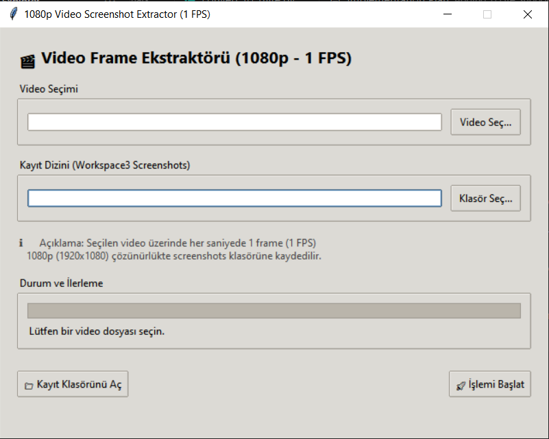

# Ahmet Çimen 07/29/2026 Çalışma Notları

## 1. 1080p Video Ekran Görüntüsü ve Kare Çıkarma Aracı (Frame Extractor)
Ekip arkadaşımın ihtiyaç duyduğu görsel verileri elde edebilmek amacıyla Python ve Tkinter tabanlı modüler bir **1080p Frame Extractor (Görüntü Çıkarıcı)** aracı geliştirdim.

- **Araç Özellikleri ve Çalışma Mantığı:**
  - Kullanıcı dostu ve modern karanlık (dark mode) grafik arayüz (GUI) ile istenen video dosyası ve hedef çıktı dizini dinamik olarak seçilebilir.
  - Seçilen videonun kare hızından (FPS) bağımsız olarak her 1 saniyesinden tam 1 kare örnekleme yapar.
  - Çıkartılan tüm kareler yüksek kalitede `1920×1080` (1080p) çözünürlüğe ölçeklenerek PNG formatında kaydedilir.
  - Arka planda threading kullanılarak arayüz kilitlenmesi önlenmiş, anlık progress bar ve zaman damgalı dosya adlandırma (`frame_sec_XXXXX_00m00s.png`) sistemi kurulmuştur.
- **Saha Testi ve Teslimat:** Hazırlanan araç test videosu üzerinde çalıştırılmış, saniyelik kareler çıkartılarak veri etiketleme ve inceleme yapacak ekip arkadaşıma iletilmiştir.

### Frame Extractor Grafik Arayüzü:

---

## 2. PyTorch Modellerini TensorFlow Lite (TFLite) Formatına Dönüştürme Aracı
Elimizdeki PyTorch tabanlı yolo ve deep learning modellerini gömülü ve edge device'larda daha yüksek performans, düşük gecikme ve düşük kaynak tüketimiyle çalıştırabilmek amacıyla **TensorFlow Lite Dönüştürme Aracı** geliştirdim.

---

## 3. Gerçek Dünya Bağımsız Test Verileri ve Veri Etiketleme (Ground Truth) İncelemesi
Elimizdeki segmentasyon modellerini kıyaslarken IoU (Intersection over Union) testlerini yalnızca verisetinde kullanılan videolardaki karelerle sınırlı tutmak yerine, modelin gerçek dünya şartlarındaki genelleme başarısını ölçecek bağımsız bir değerlendirme ortamı tasarlamak için gerekli etiketli verileri oluşturmada seçenekleri değerlendirdim.

- **Bağımsız Değerlendirme Yaklaşımı:**
  - Veri setimizdeki videolardan bağımsız olarak, başka bir kullanıcının paylaştığı gerçek dünyadan çekilen test görüntüsü üzerinden kareler çıkartılması hedeflendi.
  - Çıkartılan bu karelerin etiketlenerek referans doğruluk (Ground Truth) maskelerinin üretilmesi ve IoU testlerinin veri setimizden tamamen izole bir ortamda yürütülmesi planlandı.
- **Veri Etiketleme Yöntemleri ve Araç İncelemesi:**
  - Demiryolu ve ray koridoru senaryomuza en uygun veri etiketleme yöntemleri ve araçları gözden geçirildi.
  - Bu doğrultuda, özellikle demiryolu senaryolarına uygun olan **Labels4Rails Annotation Tool** veri etiketleme aracı incelendi.
  - Önümüzdeki günlerde bu araçların verilerden ground truth elde etmek için kullanılma imkanının olup olmadığı değerlendirilecektir.

---

## 4. Model Çıkarım ve Benchmark İstatistikleri (Liderlik Tablosu)
Yapılan testlerde hem PyTorch çıkarım altyapısı hem de hazırlanan benchmark pipeline'ı üzerinden kaydedilen liderlik tablosu metrikleri aşağıda özetlenmiştir:

| Model Adı | GPU Çıkarım FPS | GPU Gecikme (ms) | Sistem Akış FPS | Sistem Gecikmesi (ms) | Test Tarihi |
| :--- | :---: | :---: | :---: | :---: | :---: |
| **`best_yolov8n_seg`)** | **36.59 ± 2.1** | **27.69 ms** | **30.99** | **32.67 ms** | 2026-07-29 |
| **`yolov8n_multiclass_25`** | 33.79 ± 3.1 | 30.29 ms | 21.77 | 46.65 ms | 2026-07-28 |
| **`yolov8n_multiclass_35`** | 31.20 ± 2.43 | 32.46 ms | 20.59 | 48.99 ms | 2026-07-28 |
| **`deeplabv3plus+resnet50`** | 23.98 ± 1.2 | 41.82 ms | 17.37 | 57.79 ms | 2026-07-28 |

---

## 5. Hedefler
Önümüzdeki günlerde yürütülmesi planlanan çalışmalar:

1. **TFLite Model Edge Cihaz Testi:** TensorFlow Lite formatına çevirilen modellerin testini bir edge (gömülü) cihaz üzerinde gerçekleştirip PyTorch modeline göre performans karşılaştırmasını (FPS, gecikme vb.) yapmak.
2. **Labels4Rails ile Ground Truth Oluşturma:** Gerçek dünya test karelerinin **Labels4Rails Annotation Tool** kullanılarak etiketlenmesi, ground truth verisinin elde edilmesi ve modellerin veri setimizden bağımsız IoU başarımının ölçülmesi.
3. **Leaderboard Geliştirme:** Leaderboard üzerinde ölçülen IoU skorlarının da gösterilmesi. Her model farklı sınıflar(railbed, tram-track vb.) üzerinde çıkarım yaptığı için, modeller arasında adil bir kıyaslama sağlamak adına yalnızca tüm modellerin ortak sahip olduğu `rail-track` (sürüş koridoru) sınıfı üzerinden IoU skorlarının değerlendirilmesi.

