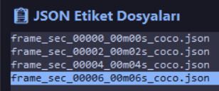
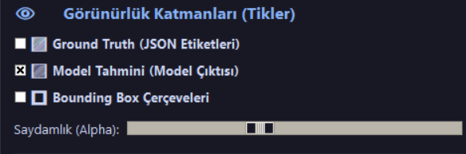
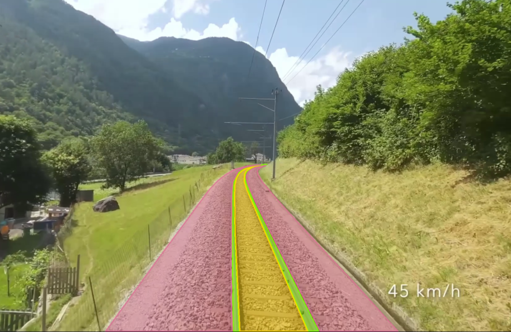
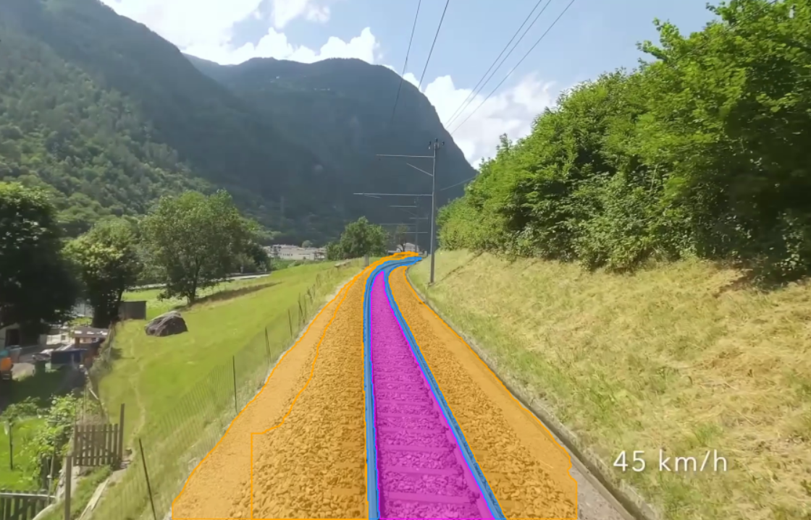
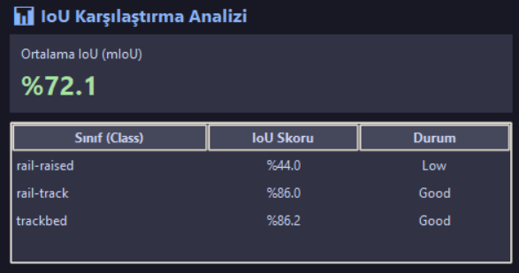
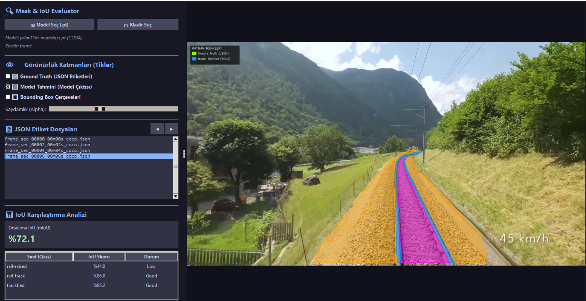

# Günlük Çalışma Raporu — Gün 11

## 1-) Maske ve IoU Karşılaştırma Analiz Aracı (Mask & IoU Evaluator)

Egitilen derin öğrenme segmentasyon modellerinin (örneğin YOLO segmentasyon modelleri) doğruluk ve başarısını değerlendirebilmek amacıyla el ile etiketlenmiş referans veriler (**Ground Truth**) ile model tahminleri arasında **IoU (Intersection over Union)** karşılaştırması yapan ve anlık görsel doğrulama sunan bir masaüstü analiz aracı geliştirilmiştir.

Geliştirilen araç, karmaşık komut satırı süreçlerine ihtiyaç duymadan etiketlenmiş verileri otomatik olarak seçilen klasörden çeker ve kullanıcı dostu bir grafik arayüz (GUI) üzerinden modellerin performansını piksel bazında analiz etme olanağı tanır.

---

### A. Otomatik Veri Taraması ve Dosya Listeleme

Araç, seçilen çalışma klasörü içerisindeki COCO formatındaki etiketli JSON dosyalarını ve bu etiketlere karşılık gelen orijinal görüntüleri otomatik olarak tespit edip arayüzdeki panelde listeler. Kullanıcı listeden istediği kareyi seçerek anında görselleştirme alanına aktarabilir.

---

### B. Katman Görünürlüğü ve İnteraktif Kontrol Paneli

Farklı katmanların detaylı incelenebilmesi için arayüzde dinamik görünürlük katmanları ve saydamlık (Alpha) ayarı sunulmuştur. Kullanıcı isteğe bağlı olarak aşağıdaki katmanları açıp kapatabilir:
- **Ground Truth (JSON Etiketleri):** El ile etiketlenmiş gerçek referans maskeler.
- **Model Tahmini (Model Çıktısı):** Yüklenen modelin ürettiği anlık segmentasyon maskeleri.
- **Bounding Box Çerçeveleri:** Nesnelere ait sınır kutuları.
- **Saydamlık (Alpha Slider):** Maskelerin orijinal görüntü üzerindeki opaklık derecesinin ayarlanması.

---

### C. Ground Truth ve Model Tahmin Maskelerinin Görsel İncelemesi

Listelenen veriler üzerinden seçilen bir kare için el etiketli **Ground Truth** maskesi ile **Model Tahmini** maskesi bağımsız katmanlar olarak ve renk kodlarıyla ayrıştırılarak görselleştirilmektedir. Bu sayede modelin hangi bölgelerde aşırı veya eksik segmentasyon yaptığı görsel olarak hızla tespit edilebilmektedir.

#### Örnek Ground Truth Maskesi Gösterimi:

#### Örnek Model Tahmini (YOLO) Maskesi Gösterimi:

---

### D. Otomatik Sınıf Bazlı IoU ve mIoU Skoru Hesaplama

Araç, seçilen karedaki her semantik sınıf (`rail-track`, `rail-raised`, `trackbed` vb.) için piksel bazlı kesisim/birleşim oranını hesaplayarak sınıf bazlı IoU skorlarını ve genel Ortalama IoU (**mIoU**) değerini anlık olarak tabloda sunar. Skorun seviyesine göre başarı durumu (*Good*, *Low* vb.) otomatik değerlendirilir.

---

### E. Bütünleşik Masaüstü Grafik Kullanıcı Arayüzü (GUI)

Tüm tarama, katman yönetimi, görselleştirme ve metrik hesaplama modüllerini tek bir ekranda toplayan bütünleşik kullanıcı arayüzü aşağıda verilmiştir.

---

## 2-) Gelecek Hedefler ve Sonraki Adımlar

Geliştirilen IoU analiz aracının yeteneklerini ve kullanım alanını genişletmek amacıyla ilerleyen süreçte aşağıdaki geliştirmelerin yapılması planlanmaktadır:

1. **İnteraktif Zoom (Yakınlaştırma / Uzaklaştırma):** Görselleri ve maskeleri gösteren arayüz alanında fare tekerleği veya kontroller ile piksel detaylarına inmeye imkan tanıyan Zoom in / Zoom out yeteneğinin eklenmesi.
2. **Çoklu Model Karşılaştırma Altyapısı:** Sadece tek bir model ile Ground Truth kıyaslaması yerine; birden fazla farklı modelin (örneğin YOLOv8, DeepLabV3+, SegFormer vb.) çıktılarını hem birbirleriyle hem de Ground Truth ile aynı anda yan yana kıyaslayabilen çoklu model analiz altyapısının geliştirilmesi.
