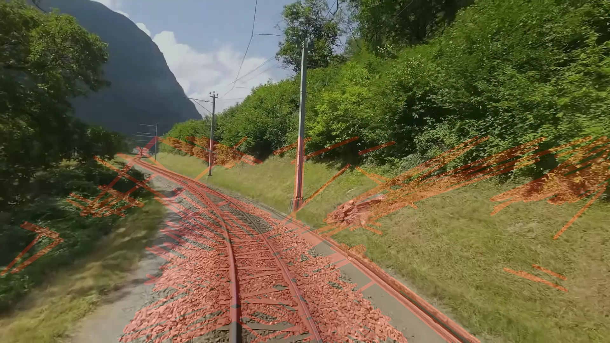
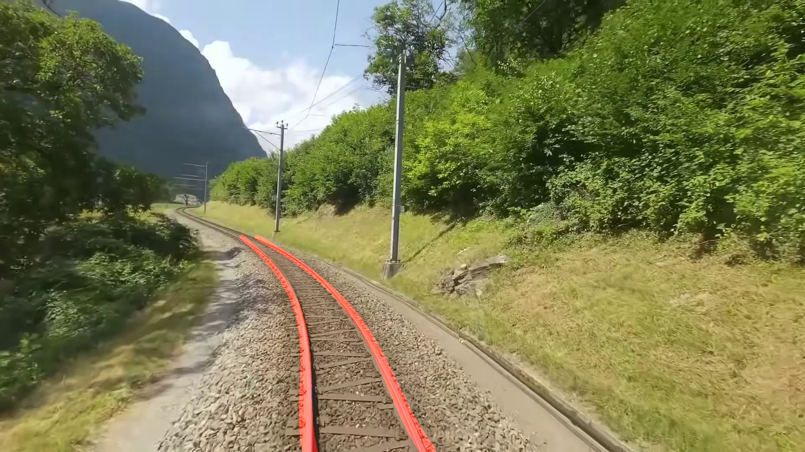
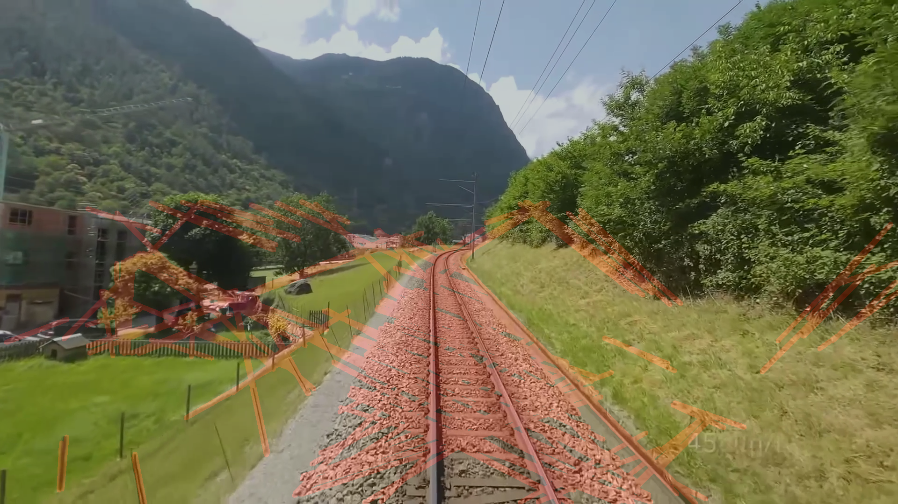
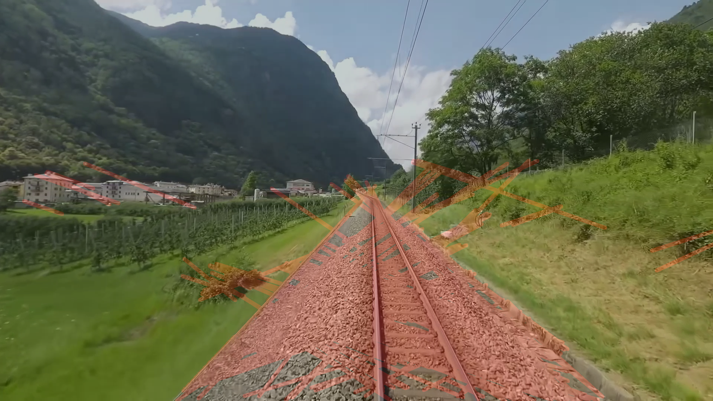
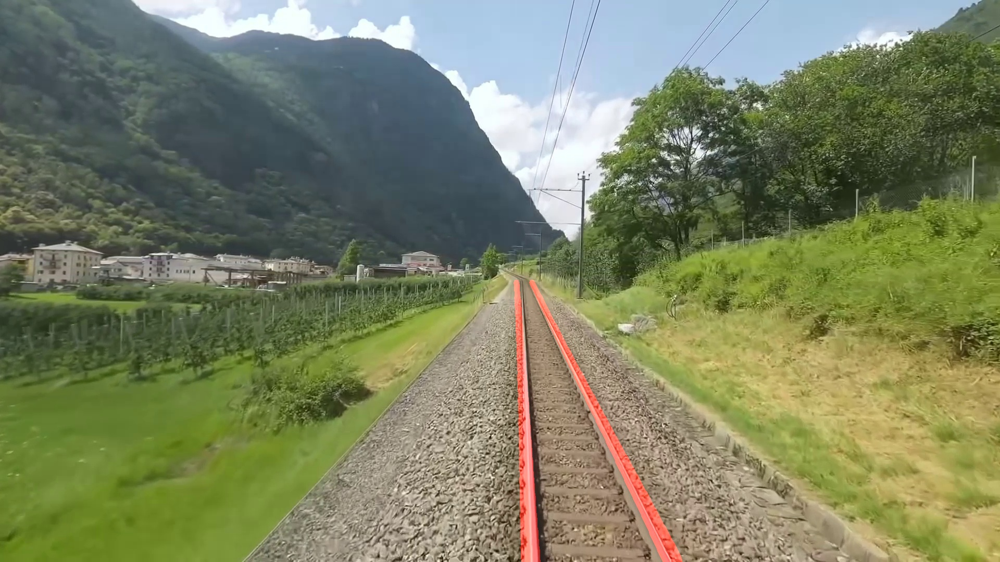
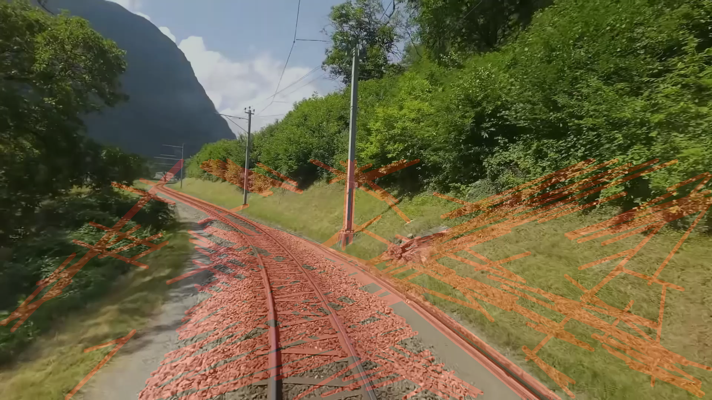
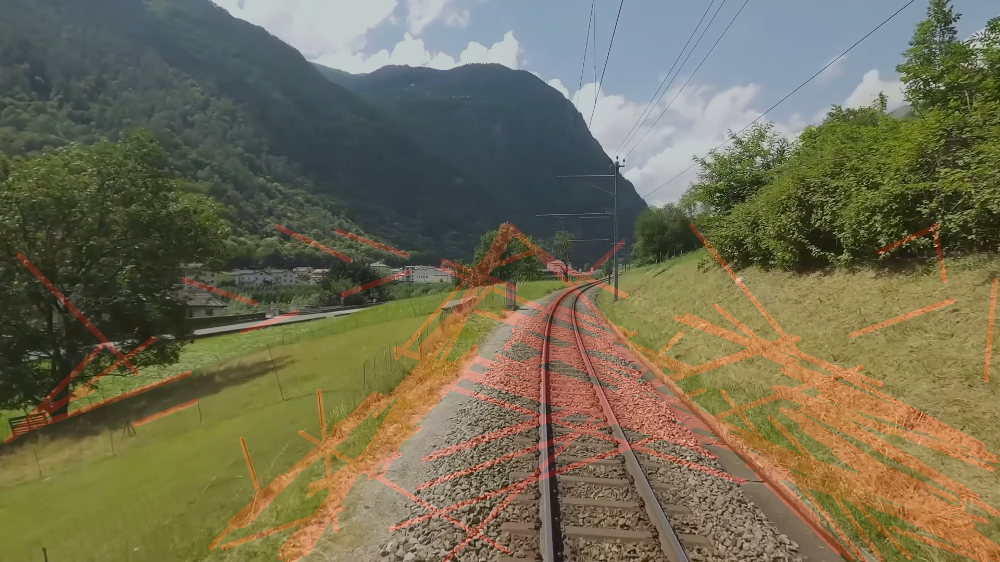
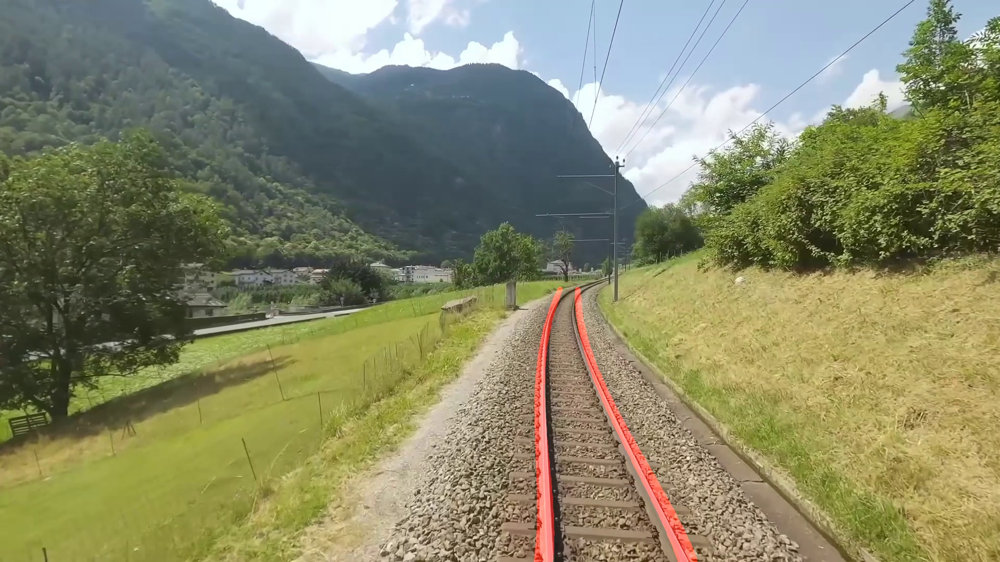
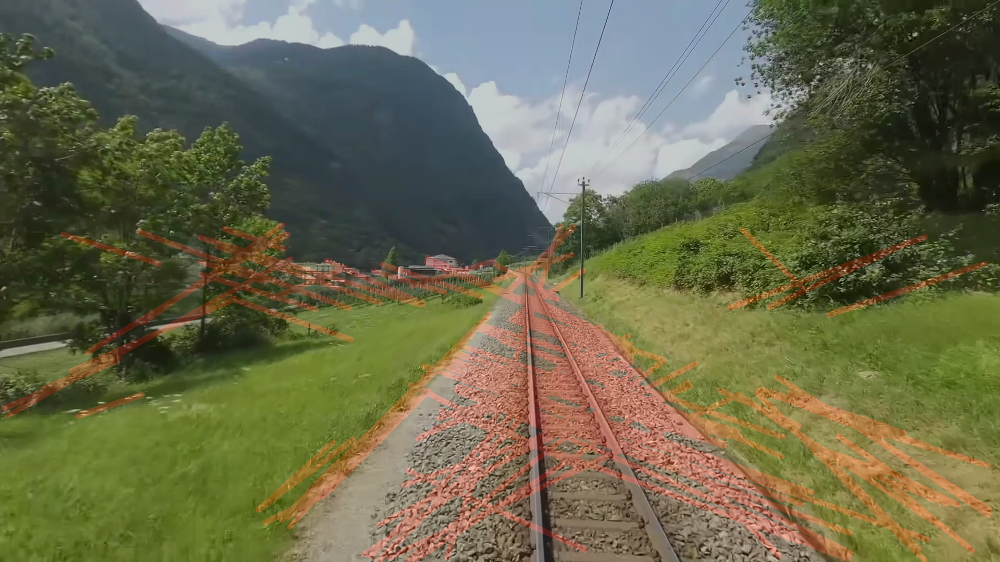
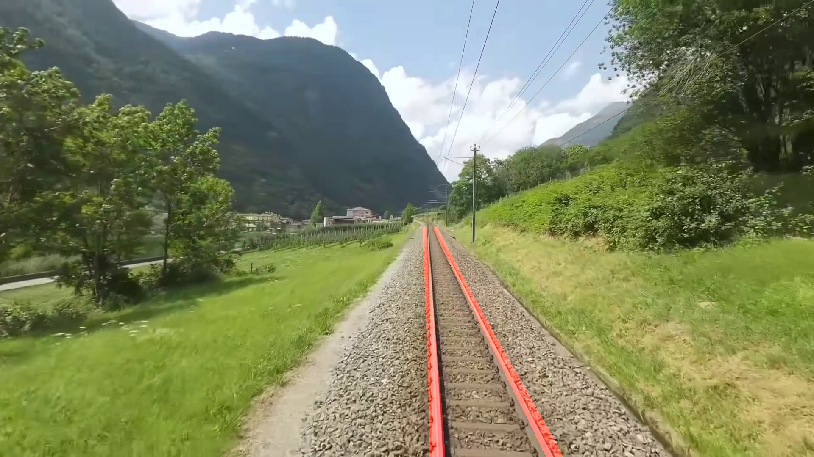

# Ahmet Çimen Çalışma Notları (Gün 12)

## Özet

Bugün, tren raylarının tespiti için derin öğrenme modellerinden biri olan YOLO'yu bir edge cihaz üzerinde çalıştırmak yerine, hedeflenen yüksek FPS ve düşük gecikme (latency) değerlerine ulaşabilmek amacıyla Geleneksel Görüntü İşleme (Klasik Bilgisayarlı Görme) algoritmalarını test ettim. Bu kapsamda Canny + Hough ve CLAHE + Canny + Hough yöntemlerini inceledim.

- **Canny + Hough:** Görüntüdeki belirgin kenarları Canny algoritmasıyla bulup, Hough dönüşümü kullanarak doğrusal hatları (rayları) tespit etmeyi amaçlayan klasik bir yöntemdir.
- **CLAHE + Canny + Hough:** Temel Canny + Hough yöntemine ek olarak, görüntü kontrastını bölgesel olarak artıran CLAHE yöntemini kullanarak aydınlatma farklılıklarına ve parlamalara karşı daha dirençli bir kenar tespiti yapmayı hedefler.

Yaptığım denemeler sonucunda, bu iki klasik yöntemin de çevresel etkilere ve gürültüye karşı yetersiz kaldığını ve ray tespiti konusunda başarısız olduğunu gözlemledim.

## Karşılaştırmalı Sonuçlar

Aşağıda denenen yöntemlerin ürettiği sonuçlar ile referans YOLO modelinin ürettiği sonuçların karşılaştırması yer almaktadır.

### Canny + Hough Yöntemi Sonuçları

| Canny + Hough Sonucu | YOLO Sonucu |
|---|---|
|  |  |
|  |  |
|  |  |

### CLAHE + Canny + Hough Yöntemi Sonuçları

| CLAHE + Canny + Hough Sonucu | YOLO Sonucu |
|---|---|
|  |  |
|  |  |
|  |  |

## Gün Sonu Değerlendirmesi

Canny + Hough ve CLAHE + Canny + Hough yöntemleri gölgeler, yansımalar ve ray dışındaki düz hatlar gibi gürültülerle karşılaştığında son derece yanıltıcı sonuçlar verdi. Edge device üzerinde YOLO gibi derin öğrenme tabanlı bir model kullanmaktan kaçınarak hız kazanmayı hedeflesek de, bu geleneksel algoritmaların ray tespiti doğrulukları bakımından tamamen başarısız olduğu sonucuna vardım.
