# Ahmet Çimen Çalışma Notları (Gün 13)

## Özet

Bugün, tıpkı bir önceki gün yaptığım gibi ağır derin öğrenme modellerini edge cihazlar üzerinde çalıştırmak yerine, yüksek FPS ve düşük gecikme elde edebilmek adına kullanılabilecek diğer Geleneksel Görüntü İşleme yöntemlerini denedim. Bu kapsamda Frangi filtresi ve Dinamik Programlama (Dynamic Programming) temelli yöntemleri test ettim.

- **Frangi + Hough Yöntemi:** Damar ve benzeri tüp/çizgi şeklindeki yapıları belirginleştiren Frangi filtresini kullanarak rayları ön plana çıkarmayı ve ardından Hough dönüşümüyle bu doğruları tespit etmeyi amaçlayan bir yöntemdir.
- **Dynamic Programming (Dinamik Programlama) Yöntemi:** Görüntü üzerindeki potansiyel ray pikselleri arasında en düşük maliyetli yolu bularak, ray hattını kesintisiz ve sürekli bir eğri şeklinde takip etmeye çalışan optimizasyon tabanlı bir algoritmadır.

Testlerim sonucunda, bu iki klasik yöntemin de değişen çevre koşullarına karşı oldukça kırılgan olduğu ve rayları kararlı bir şekilde tespit edemediği için başarısız olduğu görülmüştür.

## Karşılaştırmalı Sonuçlar

Aşağıda denenen yöntemlerin ürettiği sonuçlar ile referans YOLO modelinin ürettiği sonuçların karşılaştırması yer almaktadır.

### Frangi + Hough Yöntemi Sonuçları

| Frangi + Hough Sonucu | YOLO Sonucu |
|---|---|
| 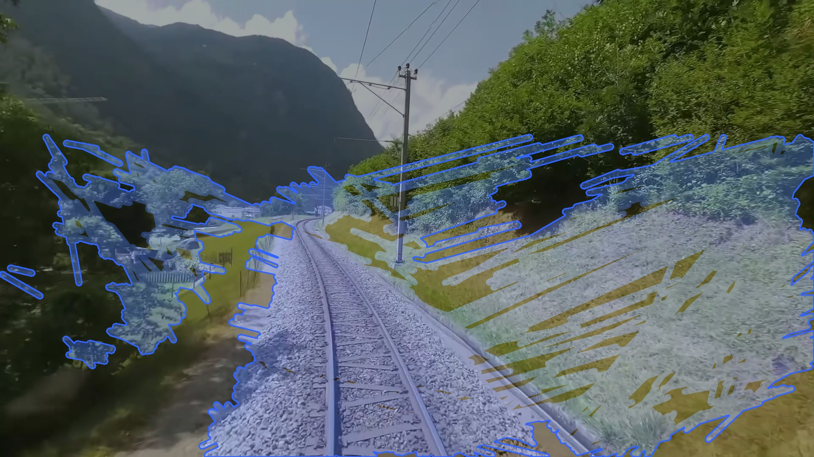 | 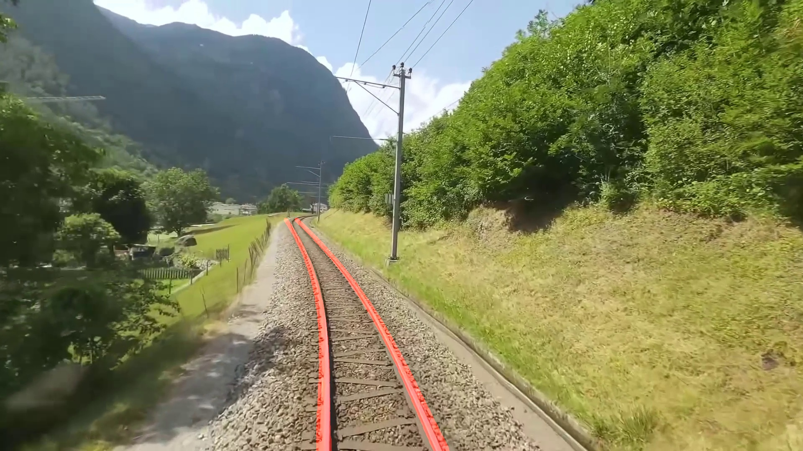 |
| 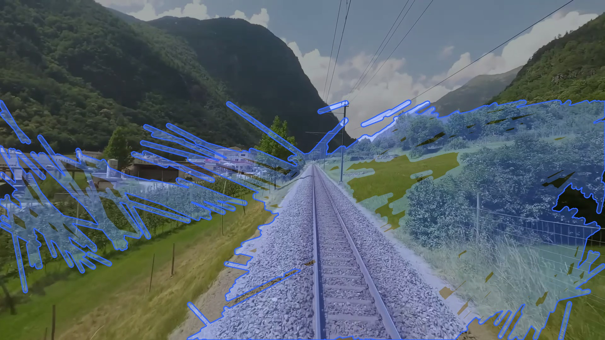 | 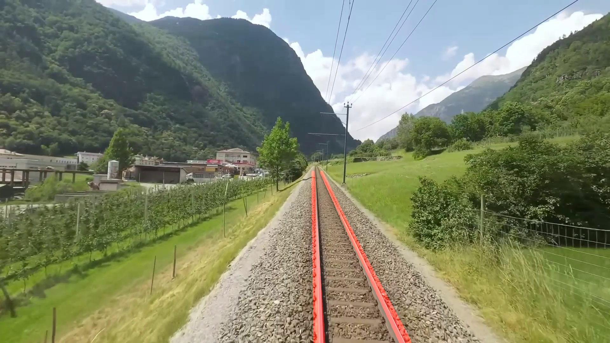 |
| 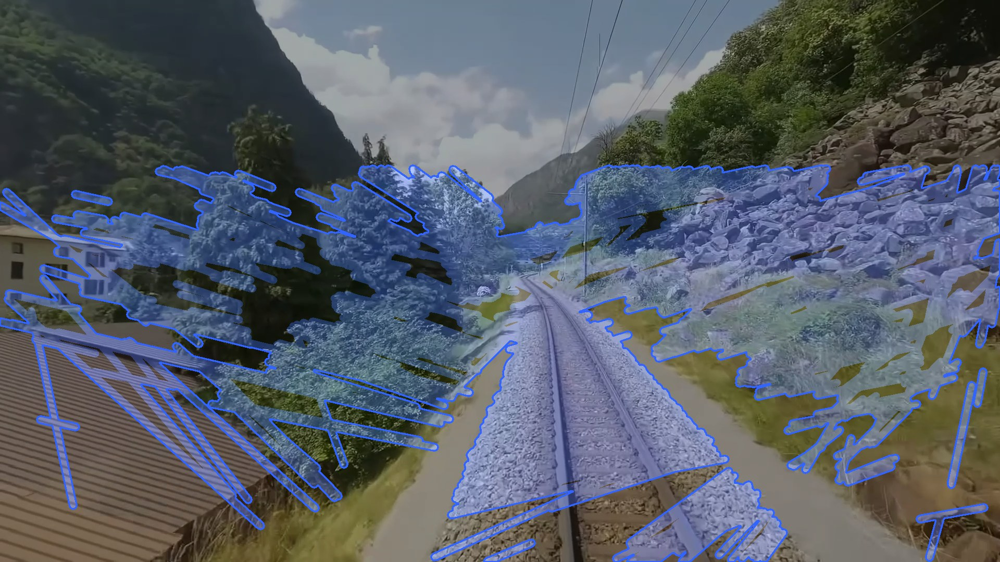 | 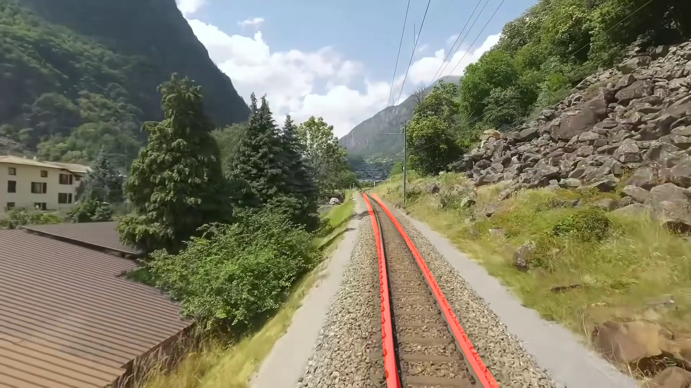 |

### Dynamic Programming Yöntemi Sonuçları

| Dynamic Programming Sonucu | YOLO Sonucu |
|---|---|
| 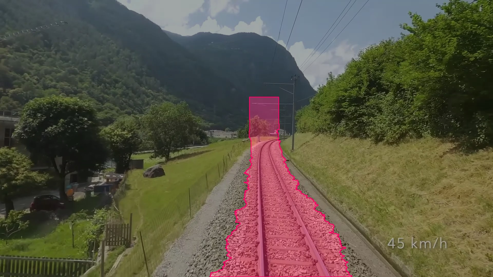 | 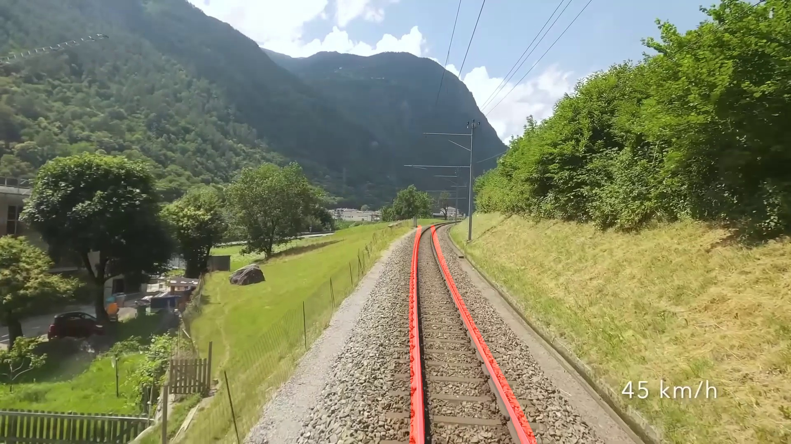 |
| 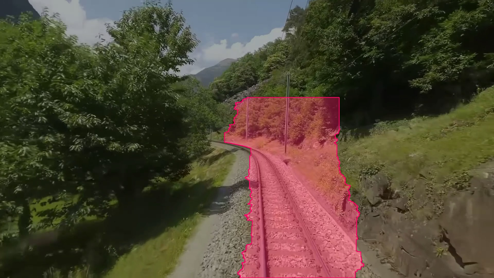 | 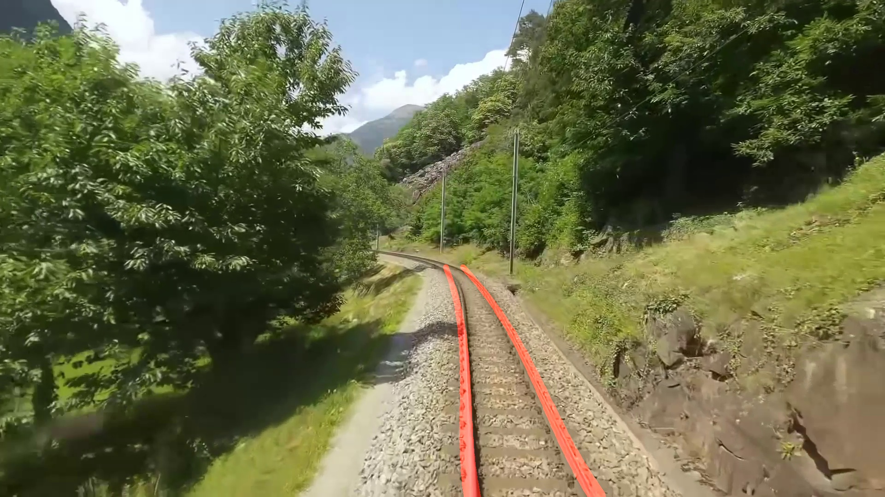 |
| 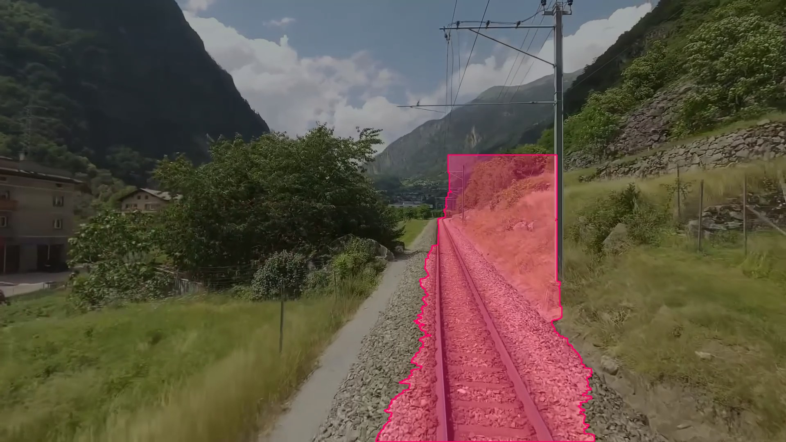 | 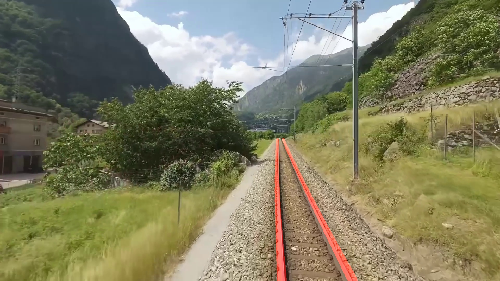 |

## Gün Sonu Değerlendirmesi

Frangi + Hough ve Dynamic Programming yöntemleri, hedeflenen düşük donanım kaynağı tüketimini sağlayabilme potansiyeline sahip olsalar da pratik kullanımda oldukça yetersiz kaldılar. Klasik yöntemler, gerçek dünyanın değişken koşullarında (aydınlatma, kamera açısı, gölge gibi etkilerde) çok fazla yanlış pozitif üretmiş ya da rayları tamamen kaçırmıştır. Bu durum, YOLO gibi yapay zeka modellerine kıyasla matematiksel algoritmaların oldukça dayanıksız olduğunu göstermiştir.
