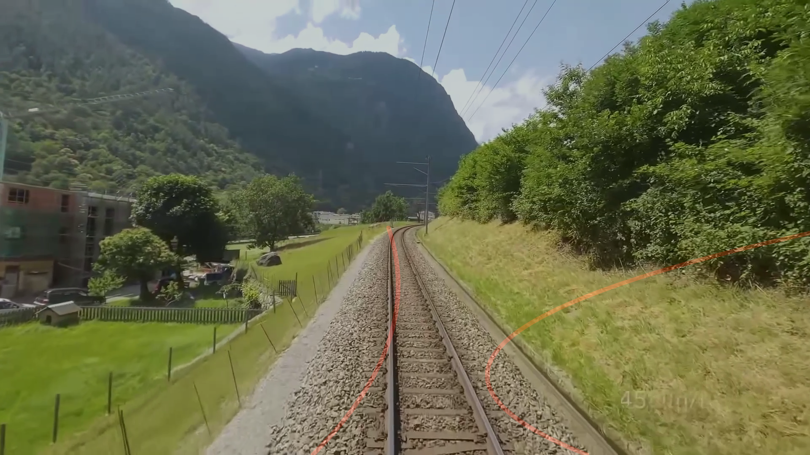
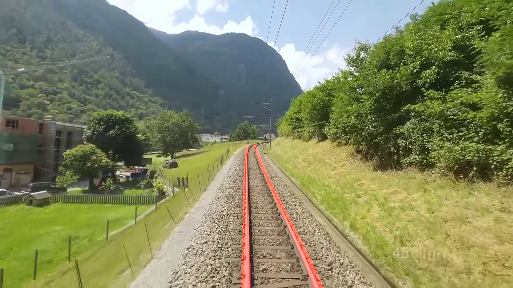
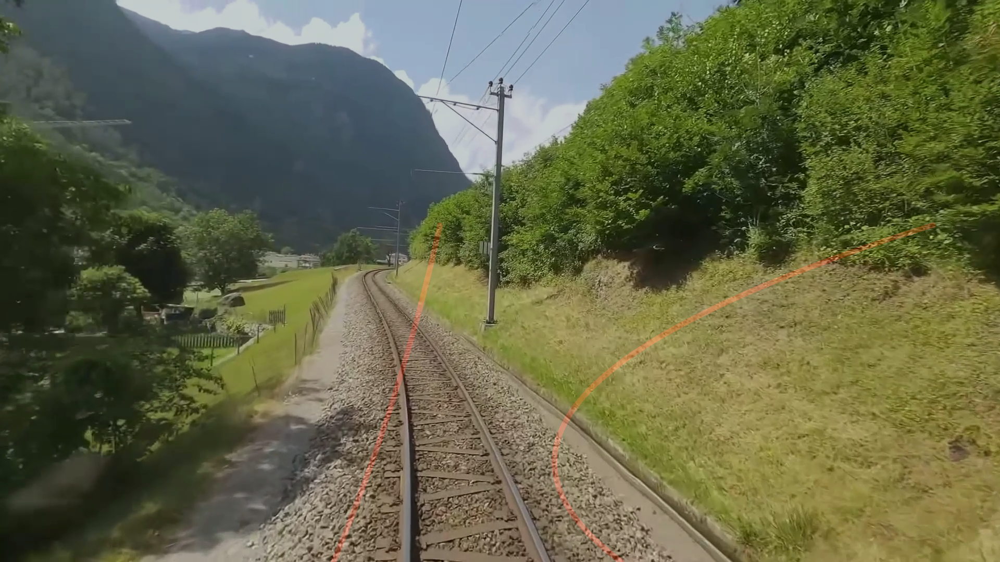
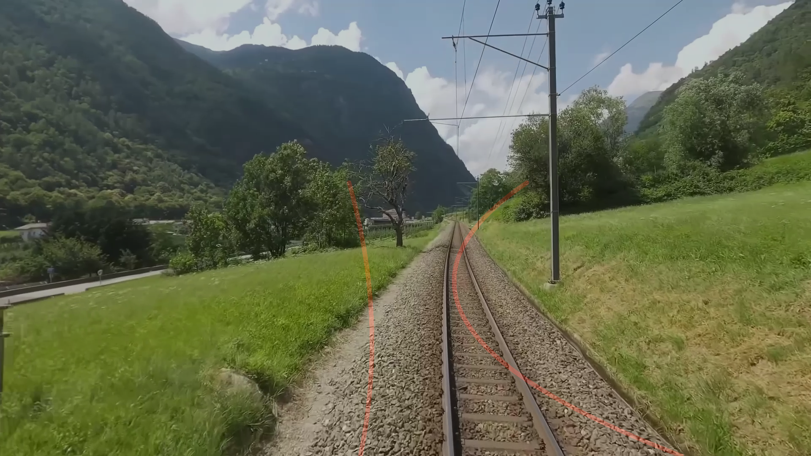
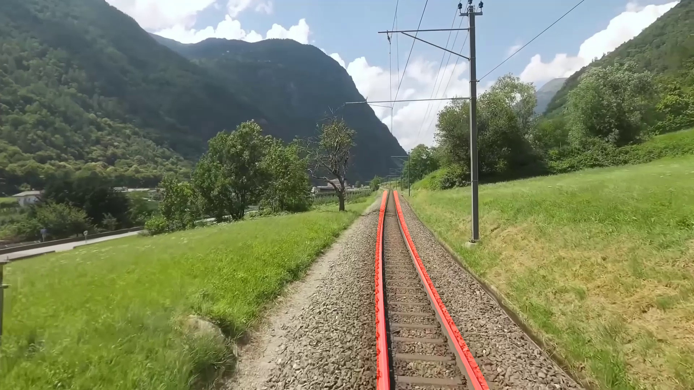

# Ahmet Çimen Çalışma Notları (Gün 14)

## Özet

Bugün, önceki günlerde olduğu gibi edge cihazlarında (düşük gecikme ve yüksek FPS ile) çalışabilecek geleneksel/matematiksel görüntü işleme algoritmalarının testlerine devam ettim. Bu kapsamda hedeflenen verimi sağlayıp sağlayamayacaklarını gözlemlemek adına **Band Tracking** ve **RANSAC** yöntemlerini değerlendirdim.

- **Band Tracking Yöntemi:** Görüntü üzerinde ardışık şeritler (bantlar) halinde inceleme yaparak, rayların oluşturduğu belirgin renk/yoğunluk geçişlerini takip etmeyi ve kesintisiz bir hat çizmeyi hedefleyen bir yöntemdir.
- **RANSAC Yöntemi:** Kenar belirleme işlemleri sonucunda ortaya çıkan noktalar arasından, aykırı (gürültülü) pikselleri eleyerek en güçlü ve düzgün doğru modelini matematiksel olarak uydurmaya (line fitting) çalışan istatistiksel bir yaklaşımdır.

## Karşılaştırmalı Sonuçlar

Aşağıda denenen yöntemlerin ürettiği sonuçlar ile referans YOLO modelinin ürettiği sonuçların karşılaştırması yer almaktadır.

### Band Tracking Yöntemi Sonuçları

| Band Tracking Sonucu | YOLO Sonucu |
|---|---|
|  |  |
|  |  |

### RANSAC Yöntemi Sonuçları

| RANSAC Sonucu | YOLO Sonucu |
|---|---|
|  |  |
|  |  |

## Gün Sonu Değerlendirmesi

Yaptığım incelemeler sonucunda, hem Band Tracking hem de RANSAC algoritmalarının ray tespiti konusunda son derece başarısız olduğunu üzülerek gözlemledim. Her iki yöntem de çevresel faktörlere (örneğin gölgeler, ray dışındaki düz ve çizgisel nesneler, aydınlatma farklılıkları) karşı aşırı duyarlı davranarak rayları takip edememiş veya tamamen alakasız çizgiler üretmiştir. Bu testlerle birlikte, matematiksel/klasik görüntü işleme algoritmalarının sahadaki zorlu koşullar için yeterli stabiliteyi sunamadığı, dolayısıyla derin öğrenme tabanlı (YOLO gibi) yaklaşımların vazgeçilmez olduğu bir kez daha kanıtlanmıştır.
