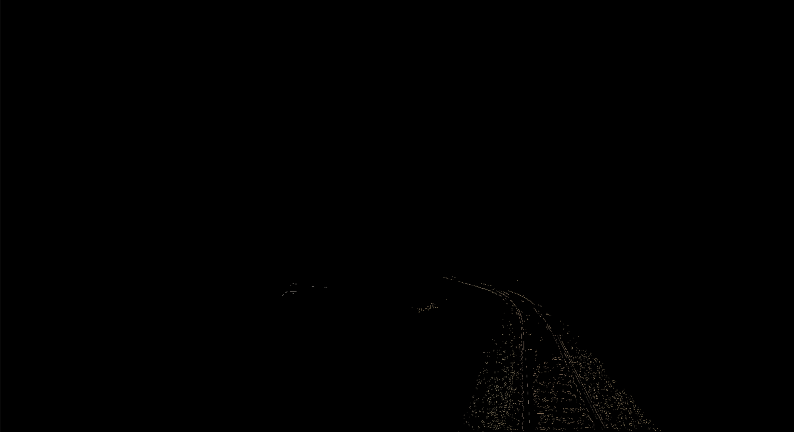
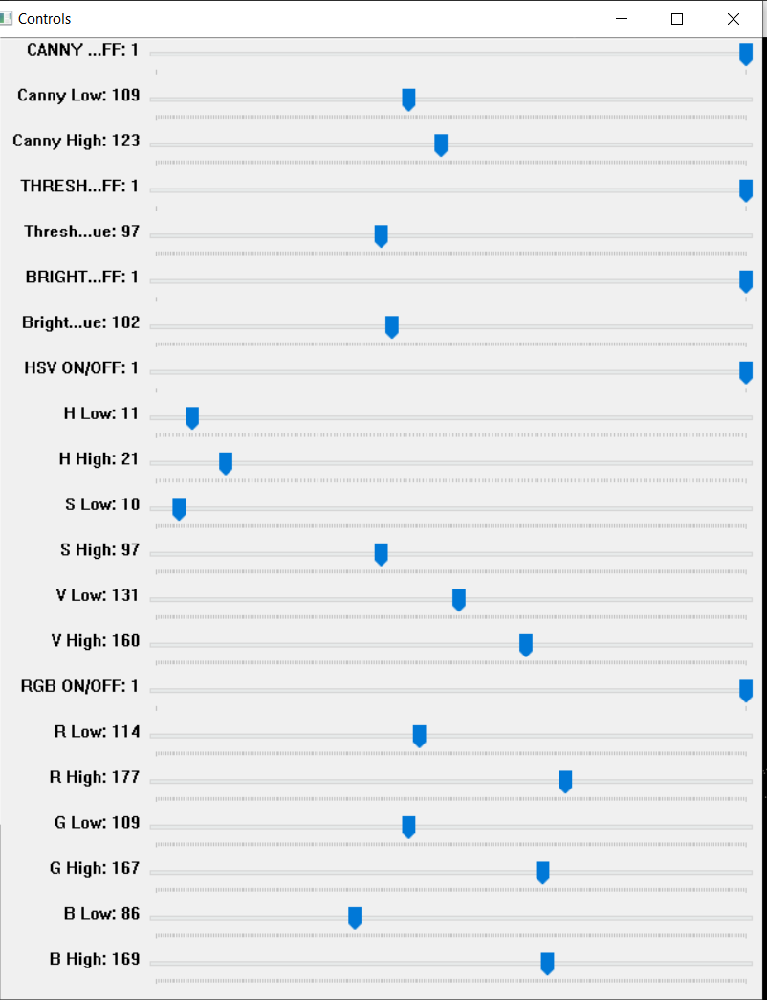

# Ahmet Çimen Çalışma Notları (Gün 17)

## Özet

Bugün, klasik bilgisayarlı görü yöntemlerinin ray tespiti ve filtreleme konusundaki sınırlarını ve video akışı üzerindeki davranışlarını test etmek amacıyla etkileşimli bir geliştirme ortamı oluşturdum. Bu doğrultuda, kamera görüntüsü üzerinde ray bölgesini dinamik olarak sınırlayan bir **Region of Interest (ROI)** seçim sistemi ve tüm filtreleme parametrelerinin gerçek zamanlı ayarlanabildiği bir **OpenCV Kontrol Paneli** geliştirdim.

## Kullanılan Teknolojiler ve Yöntemler

### 1. Region of Interest (ROI) Poligon Maskelemesi
Kamera açısından kaynaklanan gereksiz arka plan detaylarını (gökyüzü, çevre yapılar vb.) elemek ve doğrudan ray bölgesine odaklanmak amacıyla Region of Interest yaklaşımı uygulandı:
- **Örnek Kare Üzerinden Manuel Seçim:** Kullanıcı, referans alınan örnek bir video karesi üzerinden 4 köşe noktasını el ile seçerek perspektife uygun poligon bir ROI alanı tanımlamaktadır. Yalnızca bu poligon içindeki pikseller filtreleme işlemine tabi tutulur.
- **Gelecek Hedef:** İlerleyen süreçte tek kare yerine 10–20 farklı kare incelenerek belirlenen ROI'nin doğrulanması ve farklı sahnelerde test edilerek gözlemlenmesi hedeflenmektedir.

### 2. Çok Parametreli OpenCV Filtreleme Mimarisi
Klasik filtreleme algoritmalarının farklı kombinasyonlarını canlı video üzerinde anlık olarak test edebilmek için etkileşimli bir kontrol arayüzü kuruldu:
- **Canny Edge Detection:** Düşük ve yüksek gradyan eşik değerleri dinamik olarak ayarlanarak kenar sürekliliği ve gürültü ayrımı incelendi.
- **Binary Thresholding:** Gri seviye (grayscale) görüntü üzerindeki piksel yoğunlukları eşiklenerek kontrast ayrımları analiz edildi.
- **Brightness Filter:** Parlaklık eşiği üzerinden ray çeliğinin yansıma yapan yüzeyleri filtrelendi.
- **HSV & RGB Color Space Filtering:** Renk uzaylarında kanal bazlı filtreleme maskeleri oluşturularak zemin, balast ve ray arasındaki renk ayrımı test edildi.
- **Bitwise Operations:** Aktif edilen kenar, renk ve parlaklık maskeleri mantıksal `bitwise AND` operatörleriyle birleştirilerek nihai maske elde edildi.

### 3. Filtreleme ve Sonuç İncelemesi

Aşağıda, kontrol panelinde belirlenen filtre parametrelerinin uygulanması sonucunda elde edilen filtreleme çıktısı yer almaktadır:

| Filtreleme Çıktısı | Kontrol Paneli Parametreleri |
| :---: | :---: |
|  |  |

## Gün Sonu Değerlendirmesi

Geliştirilen test ortamı sayesinde klasik bilgisayarlı görü filtrelerinin parametreleri ayrıntılı biçimde incelendi:
- Yalnızca tekil renk veya kenar tabanlı klasik filtrelerin; sahnedeki sert gölgelenmeler, aydınlatma değişimleri ve traverslerin yarattığı kontrast nedeniyle rayları kesintisiz bir bütün olarak segment etmekte yetersiz kaldığı görüldü.
- Buna karşın, Region of Interest (ROI) sınırlandırması ve dikey/yatay filtre ayrıştırmasının, daha gelişmiş geometrik segmentasyon modelleri için kritik bir ön işleme adımı olduğu belirlendi.
